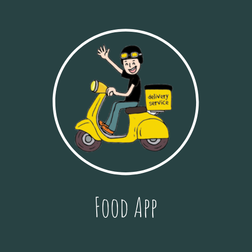

# FoodApp
The FoodApp app is a grocery store application which connects consumers, retailers
and wholesalers. With a simple and clean user interface, it provides a smooth, hassle
free experience for grocery shoppers and shopkeepers alike. The app is a simplistic
approach to making grocery shopping intuitive and fun.
# Logo :

 
   

# Development Tools :
* Platform - JetBrains Android Studio (Java development) 
* Backend - Java 
* Database -  
  * Google Firebase Realtime Database
  * Google Firebase Authentication – Phone + Gmail + Facebook
* Frontend/UI - Android Studio Layout Manager (XML) 
* UI Element Design - Adobe Photoshop  
* Location - Google Maps API 

